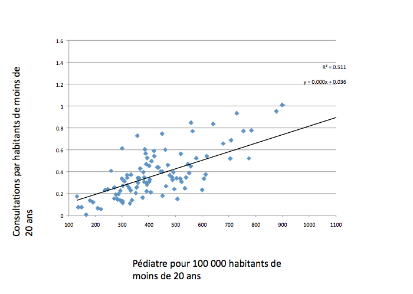

# Quel est l'effet du nombre de médecins sur la consommation médicale ? 

On regarde l'effet de l'offre de soins (ie la densité de médecins) sur la consommation médicale (le nombre d'actes par affiliés). 

## Data

### 3 sources de données

* La population des affiliés : fichier des populations protégées
* Nombre de médecins par département : Fichier RPPS 
* Le nombre d'actes par département : fichiers R du DAMIR

### Champ de l'étude

* On se restreint aux consultations chez le généraliste (sur place ou en visite).
* On se restreint aussi à l'année 2013.

## Statistiques descriptives

Nombre d'affiliés par département : 

Densité de médecins pour 100 000 habitants 

* Moyenne : 175 généralistes pour 100 000 habitants

Nombre d'actes par affiliés : 

* Moyenne : 4 consultations chez un généraliste par an

## Effet de la densité de médecins sur la consommation

Champs : Population des affiliés au 1er janvier 2013. Actes C et V. Médecins généralistes (omnipraticiens, salariés ou libéraux). 

### Modèle statistique

* Modèle simple : +100 médecins (pour 100 000 habitants) -> augmente de 0,9 le nombre de consultations par an. 

* Effet offre ou effet demande ? 
	* On contrôle par la structure d'âge du département : +100 médecins (pour 100 000 habitants) -> augmente de 0,5 le nombre de consultations par an. 
	* On contrôle par les revenus du département (part de foyers imposables + revenu médian par foyer) : +100 médecins (pour 100 000 habitants) -> augmente de 0,6 le nombre de consultations par an. 

## Limites de l'exercice

* Problème d'interprétation : effet d'induction (effet offre) ou demande révélée (effet demande) ? 
* On n'a pas les données pour contrôler de l'état de santé réel de la population locale.
	
## Pour aller plus loin

### Zoom sur la pédiatrie 

Nombre de consultations de pédiatre par an sur les populations de moins de 20 ans : 

Nombre de consultations de pédiatrie en fonction de la densité de pédiatres: 

### Pistes d'améliorations

* Plus grande profondeur temporelle (DAMIR + RPPS).  
* Pouvoir ajouter des données épidémiologiques
* Niveau géographie plus fin
* Dans RPPS : Nombre de médecins réellement en exercice

## Liens utiles

* [framapad du projet](https://lite5.framapad.org/p/EOVpfEKN9n)

